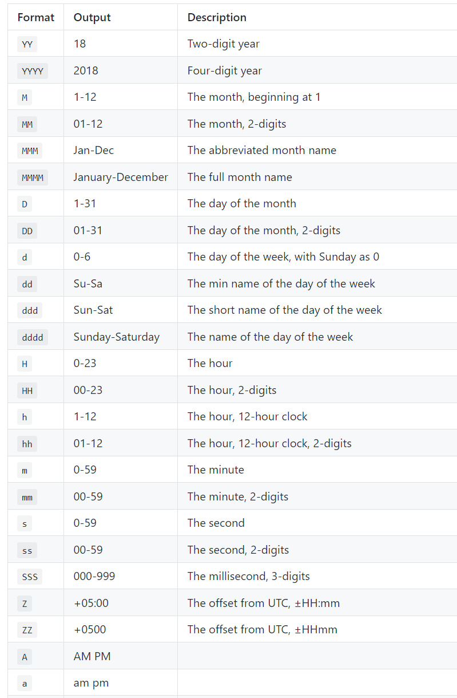

# Format with template

- Trong thư viện dayjs, phương thức `.format()` được sử dụng để định dạng đối tượng thời gian thành một chuỗi theo một mẫu cụ thể.
- Cú pháp:

```ts
dayjs(date?: string | Dayjs).format(template?: string): string
```

- Các template format:



:::tip

Để escape khỏi các template format trên, ta sử dụng dấu ngoặc vuông `[]`

:::

- Ví dụ:

```ts
import dayjs from "dayjs";

const current = dayjs();
console.log(current.format("DD/MM/YYYY HH:mm:ss [YYYYescape]")); // 02/08/2023 22:37:52 YYYYescape
```
